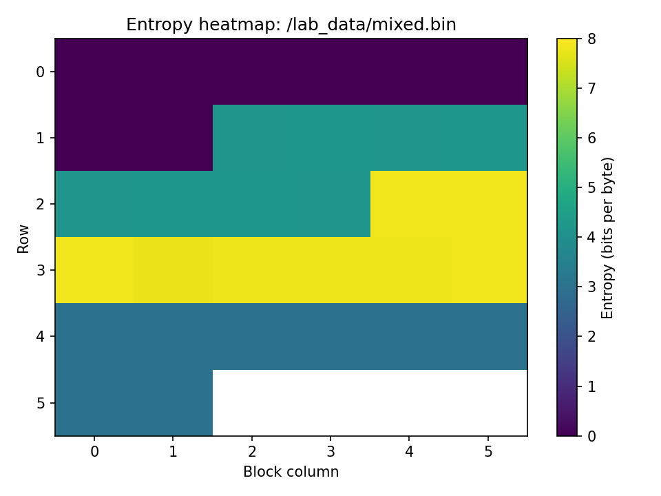

# AI Antivirus Lab (учебный проект)

AI Antivirus Lab — простой учебный AI-антивирус, работающий полностью в Docker.
Он анализирует файлы по статическим признакам (энтропия, строки, артефакты)
и отправляет отчёт в GPT, который выдаёт риск вредоносности.

Проект НЕ создаёт вирусы и НЕ исполняет файлы — только безопасный байтовый анализ.

----------------------------------------------------------------

ПРИМЕР ТЕПЛОВОЙ КАРТЫ ФАЙЛА mixed.bin  
(PNG сохраняется в lab_data/mixed_heatmap.png)



----------------------------------------------------------------

УСТАНОВКА

Сборка Docker-образа:
bash
```
docker build -t ai-security-lab .
```

Добавить OpenAI ключ:
bash
```
echo "OPENAI_API_KEY=sk-..." > secrets.env
```

----------------------------------------------------------------

ГЕНЕРАЦИЯ ТЕСТОВЫХ ФАЙЛОВ

Создать каталог:
bash
```
mkdir -p lab_data
```

1. Безопасный текстовый файл:
bash
```
docker run --rm -v "$PWD/lab_data:/lab_data" ai-security-lab \
  python -m src.sample_generator /lab_data/benign.bin --type benign --size-kb 8
```

2. Высокоэнтропийный бинарник:
bash
```
docker run --rm -v "$PWD/lab_data:/lab_data" ai-security-lab \
  python -m src.sample_generator /lab_data/suspicious.bin --type suspicious --size-kb 8
  ```

3. Файл "mixed" (разные сегменты низкой/средней/высокой энтропии):
bash
```
docker run --rm -v "$PWD/lab_data:/lab_data" ai-security-lab \
  python -m src.sample_generator /lab_data/mixed.bin --type mixed --chunk-kb 8
  ```

----------------------------------------------------------------

АНАЛИЗ ФАЙЛА (GPT-антивирус)


```
docker run --rm \
  -v "$PWD/lab_data:/lab_data:ro" \
  --env-file ./secrets.env \
  ai-security-lab \
  python -m src.app /lab_data/mixed.bin
  ```

```
Пример вывода GPT:
risk_score: 0.72  
explanation: Высокая энтропия и отсутствие безопасных признаков...
```

----------------------------------------------------------------

ASCII-ВИЗУАЛИЗАЦИЯ ЭНТРОПИИ


```
docker run --rm \
  -v "$PWD/lab_data:/lab_data:ro" \
  ai-security-lab \
  python -m src.entropy_visualizer /lab_data/mixed.bin
```

```Пример:
000 | 0.00 | ....
001 | 3.55 | ##########
002 | 7.88 | ###############################
```
----------------------------------------------------------------

PNG ТЕПЛОВАЯ КАРТА ЭНТРОПИИ


```
docker run --rm \
  -v "$PWD/lab_data:/lab_data" \
  ai-security-lab \
  python -m src.entropy_heatmap /lab_data/mixed.bin \
    --chunk-size 1024 \
    --output /lab_data/mixed_heatmap.png
```

PNG появится в lab_data/

----------------------------------------------------------------

КАК РАБОТАЕТ АНАЛИЗ

1. Файл читается как байты.
2. Извлекаются признаки:
   - общая энтропия
   - энтропия по блокам
   - строки
   - артефакты (URL, email, IP, paths)
3. Формируется текстовый отчёт.
4. GPT возвращает JSON:
   { "risk_score": ..., "explanation": ... }

----------------------------------------------------------------

БЕЗОПАСНОСТЬ

- ни один файл не запускается
- всё работает в Docker
- доступ к lab_data только read-only
- тестовые файлы безопасны
- GPT видит только текст отчёта

----------------------------------------------------------------

ВОЗМОЖНЫЕ ДОПОЛНЕНИЯ

- Web UI (Gradio / FastAPI)
- Hex-viewer
- PE-анализатор
- ML-классификация по энтропии/артефактам
